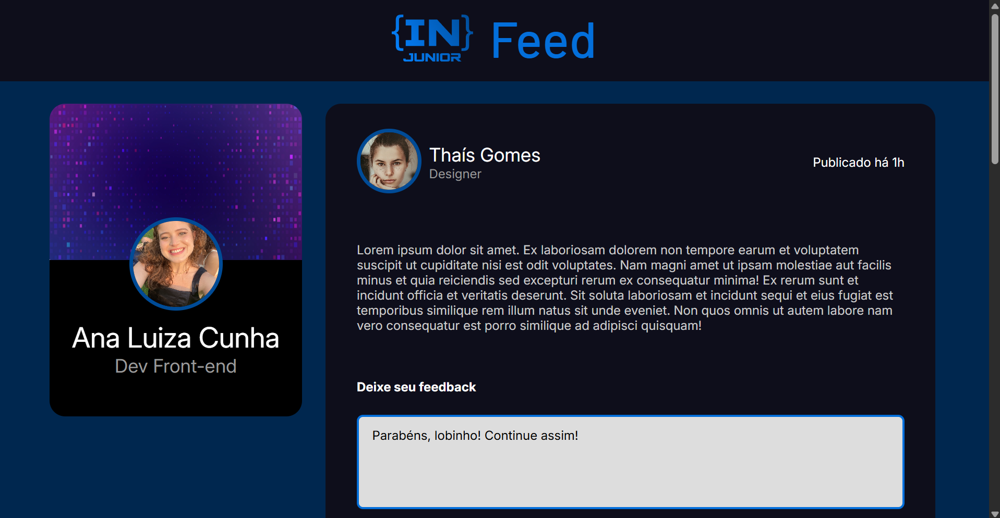
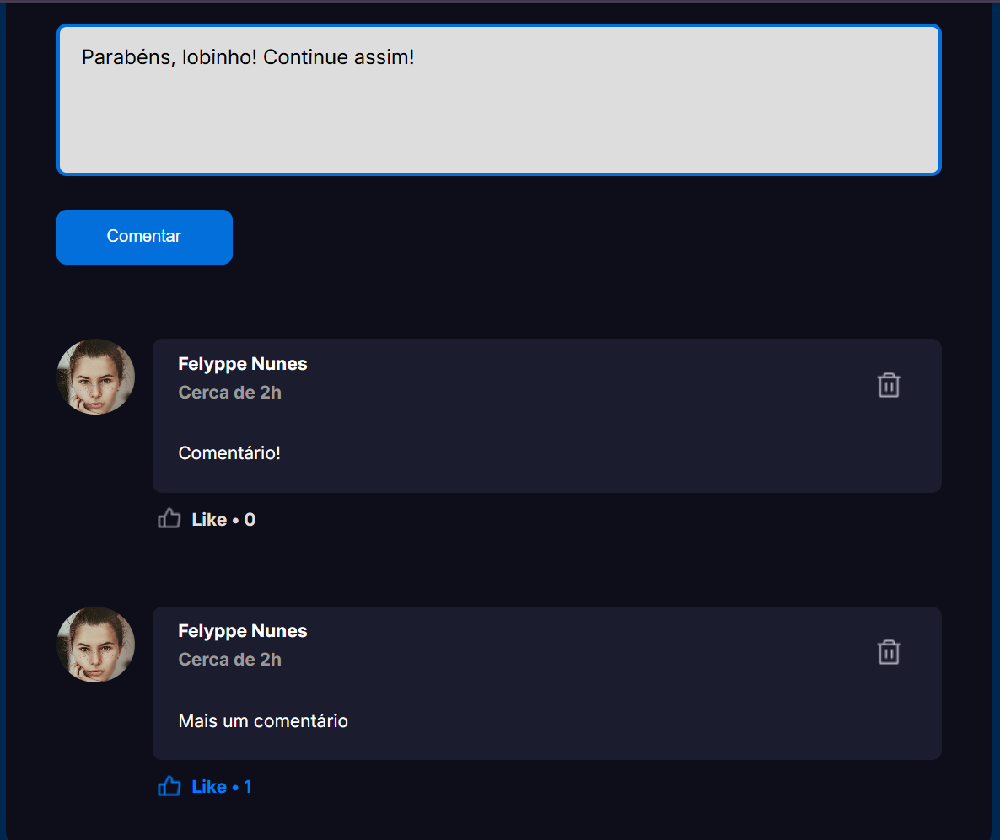

# IN Feed

Uma aplicação simples de feed de rede social construída com React, Vite e TypeScript. Este projeto foi desenvolvido para o treinamento da Empresa Junior IN Junior.

## ✨ Funcionalidades

- Visualizar uma lista de posts de diferentes autores.
- Adicionar novos comentários a cada post.
- Deletar seus comentários.
- Curtir e descurtir comentários.
- Os comentários são salvos no `localStorage` do navegador.

## 🛠️ Tecnologias Utilizadas

- **React:** Para construir a interface de usuário.
- **Vite:** Como ferramenta de build e servidor de desenvolvimento.
- **TypeScript:** Para tipagem estática.
- **CSS Modules:** Para CSS com escopo local.

## 📸 Screenshots

